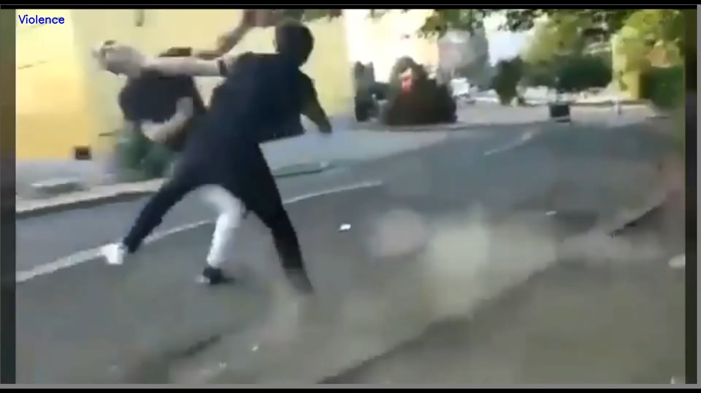

# Smart-AI-CCTV-Surveillance
<b>Automatically detects the crime and alert the authorities with the location and image of the incident.</b>

This project is an automated crime or unusual activity detector and alerts you and concerned authorities via

- Live Location
- Live Image of the Incident
- Alert Call
- Alert SMS
- Alert Email
- Police Siren, so that the nearby people get alert and also criminals might get scared and not able to commit the crime.

### Objective

To increase the safety and security of people using Smart AI CCTV Surveillance. And system can be run efficiently and accurately with minimum hardware cost.

### Problem

In today's world, safety and security are the utmost priority for everyone. We have seen there are various cases of thefts, violence, and crimes that are increasing day by day. there are many places where people don't think of going because they are not safe and people living there are always afraid. And we have seen many incidents around the world that if there is some crime being committed and nobody is there to help. So, in these cases, AI Surveillance comes out to be the most beneficial. This is one of the biggest problems in the world which needs to be solved.

### Solution

Using Machine Learning and Deep Learning (Computer Vision), to build a Smart AI CCTV Surveillance System which can easily, efficiently, and accurately detect various types of violence, crimes, thefts, and unusual activity. And alerts the Police or the concerned authorities about the incident immediately with the <b> Live Location and Live Image of the incident through Call, SMS, and Email. </b> This system will be fast and accurate that within few seconds of the incident the Police will get to know about the crime with location and the Intensity o the crime through the Live Image and make their necessary preparations before coming. So, it will not include any human interaction so there is no chance of delay reporting or human error. Moreover, the Live Image can be used as the Proof of Crime at the Incident and it will also help in catching the criminals.

### Services Offered By Smart AI CCTV Surveillance

<b>1. Protection - </b> Helps in protecting you and your home as well as the surrounding. But not limited to the one user, can be used to protect the entire building, society, area, streets, and everywhere. And assuring that there is always someone for your help and protection immediately.

<b>2. Detection - </b> Detect all the unusual happenings around you to determine if any could harm you, your property, or your loved ones. 

<b>3. 24 Hour Surveillance - </b> Gives the functionality of 24 Hour Security making it easy to keep track of all happenings without any human involvement thus reducing the scope of errors and faults.

<b>4. Alert - </b> Has the superpower to alert you as well as the concerned security authorities like police for the same with Live Location and Live image of the Incident through Call, SMS, and Email if something suspicious or wrong or any unusual activity is going on. Added all the 3 things no matter whether you are away from your phone or asleep or don't have signals in your phone but it will always keep you informed via various methods. And after that, it makes a fake Police Siren to alert nearby people. It will always have your back and make you feel protected.

<b>5. Fast and Accurate - </b> As soon as it encounters the crime, violence, or unusual activity it will take only seconds to analyze the situation and call for help. And the detection and analysis are very accurate. No matter whether there is day or night, you are in no light area or lighted area or on an alone street or a crowded street, it will always detect accurately and efficiently.

## Screenshots

### Violence

 

### Non Violence

### Alert

### Tech Stack

- Python 3
- Open CV for image detection
- Tensorflow and Keras for deep learning
- Deep Learning for training the model
- Twilio APIs

### Demo

<a href="https://drive.google.com/file/d/1DKopyTva6N_9uPtWBTE-GTMA5oxb8S_D/view?usp=sharing">PPT</a>

<a href="https://drive.google.com/file/d/1IbIyoZ_WIdQxL70Yo4brgtfdO8bElbmL/view?usp=sharing">Google Drive Main Link (Complete Pitch and Demo Video)</a>

If above Link doesn't work then click below

<a href="https://youtu.be/j8saU7cL3d4">Youtube (Only Demo Video)</a>

### Developed By

<a href="https://www.linkedin.com/in/shubham-goel-ml">Team Neurons</a>

